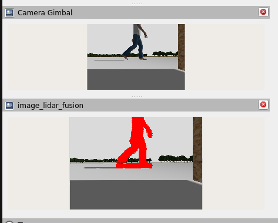
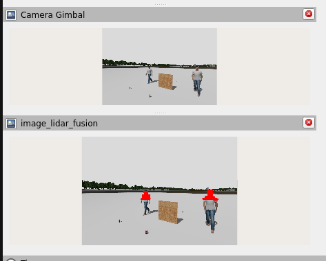
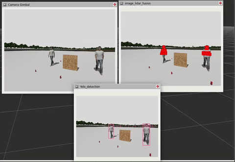
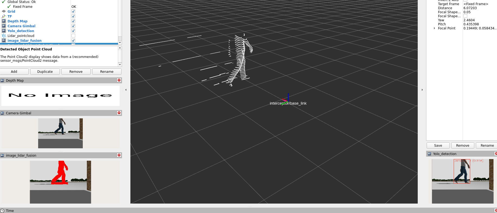
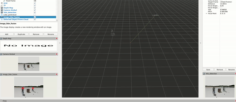

# 🤖 ROS2 Camera-Lidar Fusion Package

## 📝 Overview

A ROS2 package that performs real-time sensor fusion between 360-degree lidar and camera data. The system combines YOLOv11-based object detection with point cloud processing to achieve precise 3D object localization. It transforms lidar point clouds into the camera frame and associates point cloud clusters with detected objects to enable accurate position estimation through centroid calculation.

## ✨ Key Features

- Real-time sensor fusion between lidar and camera data streams
- Object detection using YOLOv11 neural network
- Point cloud processing and filtering with PCL library
- Dynamic coordinate frame transformation with tf2
- 3D position estimation and multi-object tracking
- Comprehensive visualization tools
- Configurable depth range and frame parameters

## 🎥 Demonstration

### 📸 Lidar-Camera Fusion Visualization

<p align="center">
Overlaying Detected Object Point Cloud Points onto Camera Image:
</p>

<p align="center">
  
  
  
</p>

<p align="center">
Publishing Points Within Detected Object Bounding Boxes:
</p>

<p align="center">
  
  
</p>

## 🔧 System Architecture

### Node Specifications
- **Node Name**: `lidar_camera_fusion_node`
- **Implementation**: C++17
- **ROS2 Version**: Humble

### Core Dependencies
- ROS2 Humble
- Point Cloud Library (PCL)
- OpenCV
- YOLOv11 ROS
- tf2
- message_filters
- geometry_msgs
- sensor_msgs

### Topic Structure

#### Subscribed Topics
- `/scan/points` ([sensor_msgs/msg/PointCloud2]) - Lidar point cloud data
- `/observer/gimbal_camera` ([sensor_msgs/msg/Image]) - Camera feed
- `/observer/gimbal_camera_info` ([sensor_msgs/msg/CameraInfo]) - Camera calibration
- `/rgb/tracking` ([yolov8_msgs/msg/DetectionArray]) - Object detection output

#### Published Topics
- `/image_lidar_fusion` ([sensor_msgs/msg/Image]) - Visualization with projected points
- `/detected_object_pose` ([geometry_msgs/msg/PoseArray]) - 3D object poses
- `/detected_object_point_cloud` ([sensor_msgs/msg/PointCloud2]) - Object point clouds

### Parameters
- `lidar_frame` (string, default: "x500_mono_1/lidar_link/gpu_lidar")
- `camera_frame` (string, default: "observer/gimbal_camera")
- `min_depth` (float, default: 0.2)
- `max_depth` (float, default: 10.0)

## 🛠️ Setup Instructions

### 📋 Prerequisites

Ensure you have the following installed:

- **ROS2 Humble** ([Installation Guide](https://docs.ros.org/en/humble/Installation.html))
- **YOLO ROS** ([Setup Instructions](https://github.com/AbdullahGM1/yolo_ros))
- **C++ Compiler**: GCC 8+
- **Required Libraries**: PCL, OpenCV, and ROS2 dependencies

### Installation Steps

#### Clone the package:

```bash
# Clone the repository
cd ~/ros2_ws/src
git clone https://github.com/AbdullahGM1/l2i_fusion_detection.git
```

#### Install ROS 2 Dependencies

```bash
sudo apt update
sudo apt install ros-humble-cv-bridge \
                 ros-humble-image-geometry \
                 ros-humble-vision-opencv \
                 ros-humble-message-filters \
                 ros-humble-tf2-ros \
                 ros-humble-tf2-geometry-msgs \
                 ros-humble-tf2-eigen \
                 ros-humble-pcl-conversions \
                 ros-humble-pcl-ros \
                 ros-humble-rclcpp \
                 ros-humble-sensor-msgs \
                 ros-humble-geometry-msgs \
                 ros-humble-vision-msgs \
                 ros-humble-pcl-conversions ros-humble-pcl-ros

```

#### Install PCL and OpenCV Dependencies
```bash
sudo apt update
sudo apt install libpcl-dev libopencv-dev
```


## 🚀 Usage

Modify the launch file `launch/lidar_fusion_detection.launch.py`:

### 1. Configure Launch File Parameters

```yaml
parameters=[
            {'min_range': 0.2, 'max_range': 10.0, # Setup your min and max range, where (x-axis) is the depth
             'lidar_frame': 'x500_mono_1/lidar_link/gpu_lidar', # Default Source frame
             'camera_frame': 'observer/gimbal_camera'}  # Default Target frame
```

### 2. Configure Topic Remapping

```yaml
remappings=[
            # Replace with actual topic names
            ('/scan/points', '/scan/points'), # The lidar point cloud topic - replace the second topic to your topic
            ('/observer/gimbal_camera_info', '/observer/gimbal_camera_info'), # The camera info topic - replace the second topic to your topic
            ('/observer/gimbal_camera', '/observer/gimbal_camera'), # The camera image topic - replace the second topic to your topic
            ('/rgb/tracking', '/rgb/tracking') # The YOLO BB tracking topic - replace the second topic to your topic
```

### 3. Configure YOLO Settings

```yaml
model': '/home/user/shared_volume/ros2_ws/src/l2i_fusion_detection/config/rgb.pt', # Add your Yolov11 Model
            'threshold': '0.5', # Set the threshold for your detection
            'input_image_topic': '/observer/gimbal_camera', # Add your in image input topic
            'namespace': 'rgb',  
            'device': 'cuda:0'
```

### 4. Build and Run

```bash
# Build the package
cd ~/ros2_ws
colcon build --packages-select l2i_fusion_detection
source install/setup.bash

# Launch the node (simulation)
ros2 launch l2i_fusion_detection lidar_fusion_detection.launch.py

# Launch the node (real sensor -> provided are the params for interealsense d345iC)
ros2 launch l2i_fusion_detection lidar_fusion_detection.launch.py
```

> ### ⚠️ Important Notes
* Make sure to publish the static transform `/tf_static` for your lidar and camera frames before running the node. This is crucial for proper coordinate frame transformation.
* If you want to run the package with simulation, you need to follow the steps in the following repo [SMART-Track-sim-setup.](https://github.com/AbdullahGM1/SMART-Track-sim-setup./tree/main)
* If you want to run just the `lidar_camera_fusion_with_detection.cpp` node without the simulation, you need to comment these parts in the launch file:
```py
    # ld.add_action(gz_launch)
    # ld.add_action(map2pose_tf_node)
    # ld.add_action(cam_tf_node)
    # ld.add_action(lidar_tf_node)
    # ld.add_action(ros_gz_bridge)
    # ld.add_action(mavros_launch)
    # ld.add_action(rviz_node)
```

## 🔍 Technical Details

### Point Cloud Processing Pipeline
- Point cloud filtering using PCL's CropBox filter
- Coordinate frame transformation (lidar to camera) via tf2
- 3D to 2D point projection onto camera image plane

### Object Detection and Tracking
- Synchronized processing of point cloud, image, and detection data
- Point cloud cluster association with detected objects
- Centroid-based position estimation

### Visualization Features
- Point cloud projection overlay on camera feed
- Bounding box visualization for detected objects
- Interactive point cloud cluster display

## 🤝 Contributing

1. Fork the repository
2. Create your feature branch (`git checkout -b feature/AmazingFeature`)
3. Commit your changes (`git commit -m 'Add some AmazingFeature'`)
4. Push to the branch (`git push origin feature/AmazingFeature`)
5. Open a Pull Request

## 📝 License

This project is licensed under the MIT License - see the LICENSE file for details.
